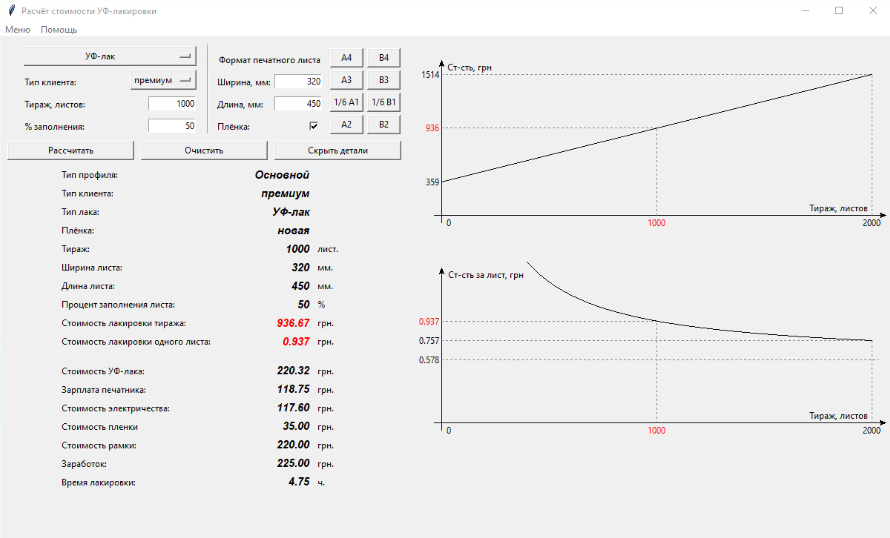
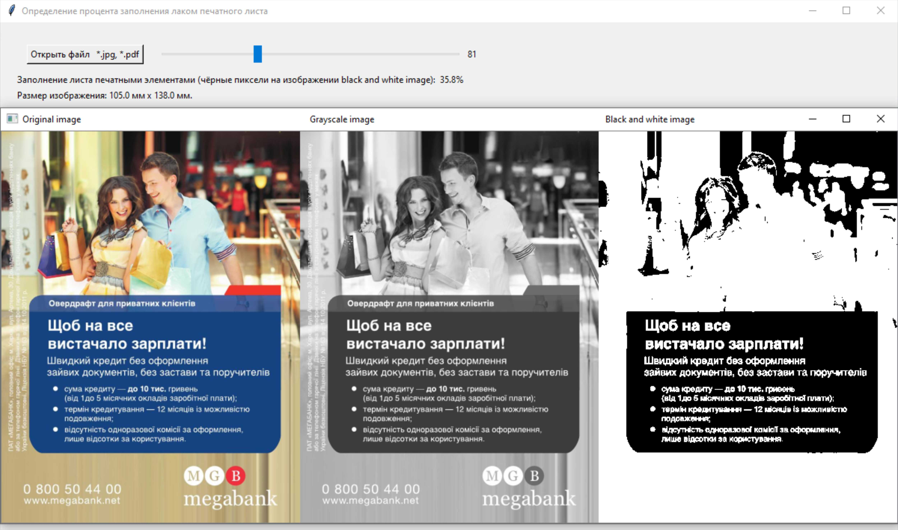

# UV-lack_calc
RU. 
UV-lack_calc представляет собой калькулятор расчета стоимости выборочной УФ-лакировки. Программа работает как десктопное приложение реализованное с использованием библиотеки Tkinter языка программирования Python 3.8. 
Функционал: 
1. Расчет стоимости выборочной УФ-лакировки согласно введенных пользователем данных.
  - возможность быстрого ввода формата печатного листа (выбор одного из стандартных форматов);
  - быстрая очистка всех введенных данных по нажатию соответствующей кнопки для выполнения следующего расчета;
  - отображение / скрытие отображения подробной калькуляции (полное финансовое описание калькуляции просчитываемого заказа);
  - поддержка создания, редактирования и использования профилей типа заказчиков с уникальными для каждого пользователя расценками;
  - использование файлов профилей (типа *.json) расположенных в локальной сети, позволяет совместное использование программы несколькими пользователями в пределах локальной сети (одного предприятия);
  - построение и визуальное отображение графиков зависимости стоимости лакировки всего тиража и одного печатного листа от размера тиража;
 2. Определение процента заполнения печатного листа элементами выборочной УФ-лакировки.
  - работа с файлами форматов *.jpg и *.pdf;
  - для файлов формата *.pdf отображение размеров печатного листа (формат загруженного изображения в мм);
  - возможность изменения средней точки пересчета изображения в формат black and white для корректного определения области нанесения УФ-лака;  
<b>Основной экран программы:</b>

  
<b>Экран страницы определения процента заполнения печатного листа УФ-лаком:</b>

